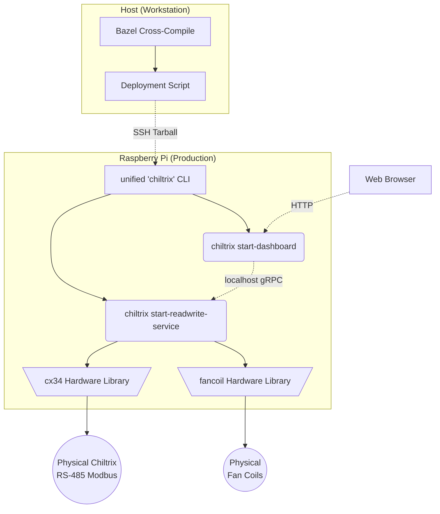

# Heatpump Architecture

This document outlines the high-level architecture and core design principles of the Chiltrix heatpump controller project.

## Core Design Principles

### 1. Minimal Hardware Interaction Libraries
The foundation of the project consists of standalone, reusable Go libraries built to interface directly with the physical HVAC hardware via serial and network protocols:
- **`cx34`**: A robust client implementation that speaks RS-485 Modbus natively to the Chiltrix unit, decoding registers into well-typed structs.
- **`fancoil`**: A native client for managing room fan coil units, built similarly to handle hardware-specific commands and queries.

### 2. Thin gRPC Server Wrappers
Rather than building large, monolithic applications, the project uses **gRPC** to decouple components into modular microservices.
Hardware libraries are wrapped in thin gRPC server services (packaged into the unified `chiltrix` CLI). For example, `chiltrix start-readwrite-service` is simply a gRPC server that binds to a port and translates incoming protobuf RPC calls down to the local `cx34` or `fancoil` libraries. 

This guarantees:
- **Safety**: Only one process natively dials the hardware interface (avoiding serial port racing constraints) while freely broadcasting status multi-cast to any amount of observers.
- **Extensibility**: It is incredibly easy to build new bots, listeners, or frontends on any language/device natively via standard `.proto` schema definitions.

### 3. gRPC Client Interfaces (UI & Web)
All higher-level consumers of data interact with the system strictly as gRPC clients connecting to the server wrappers. 
- **The Dashboard (`chiltrix start-dashboard`)**: Acts as a lightweight webserver/gRPC client that connects strictly over localhost to the read-write service, compiling the raw protobuf results into human-readable HTML/Markdown for end-users.
- **Debugging & Status (`chiltrix status`)**: A native CLI subcommand that dials the local gRPC server to fetch real-time state streams without interrupting hardware buses.

### 4. Cross-compiled Bazel Deployment
The entire project is built utilizing **Bazel**. 
Because building large Go / C++ / Protobuf dependencies seamlessly on a lightweight Raspberry Pi is exceptionally slow, all compilation is done cleanly on a host Workstation utilizing Bazel's cross-compilation rules (`goos="linux"`, `goarch="arm"`). 
The final outputs are packaged rapidly into release artifacts (e.g., `chiltrix_release.tar`) and deployed seamlessly to the Pi via SSH where everything runs persistently using `systemd`.

---

